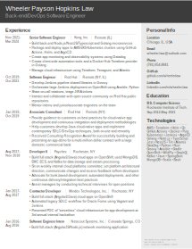

# Resume

This version of the resume is made using Inkscape. The source SVG is committed to this repo and a PDF is automatically
generated by the CI system. 

When a pull request is opened, the source file is tested by doing a simple build test and
the output of this test (a PDF) is added as an artifact to the build.

When a commit is pushed to `main` (e.g. when a pull request is merged), the PDF is built and uploaded as an asset
to a GitHub release in the repo. The versioning uses a modified [CalVer](https://calver.org/) versioning scheme in the
form of `YY.MM-PATCH`. 

